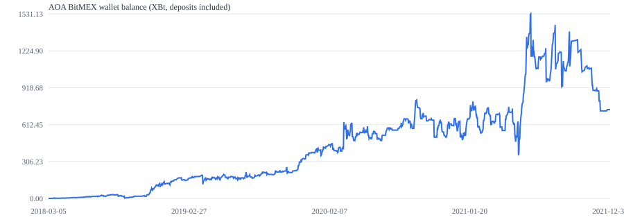
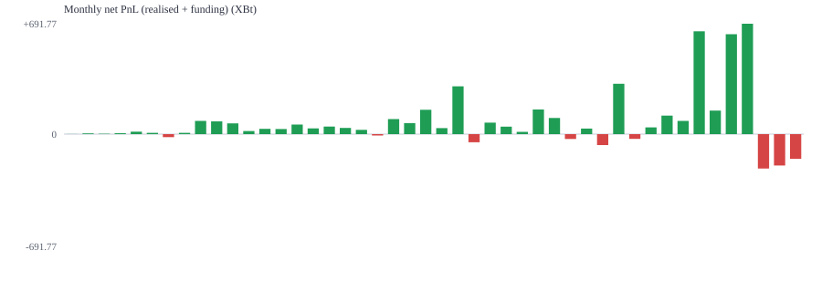

# AOA / BitMEX trading record analysis

Generated: 2026-09-22T11:55:38.291Z

Publicly disclosed by the account holder on 2026-09-22 in the DCInside 차트 마이너 갤러리
([post 5051684](https://gall.dcinside.com/mgallery/board/view/?id=chartanalysis&no=5051684)). The archive is `aoa_public_2021-12-31_with_letter.zip`
(`sha256 b6f1dc7aadf8209bf6c99fd516a06c0cabdc77c5f16f9fc8df92fdf1d8d01b9a`). This repository contains analysis code and derived
statistics only. The raw CSVs are not redistributed here.

## Coverage

- Ledger account: `aoa`
- First fill: 2018-03-05 07:28:18.063937  |  Last fill: 2021-12-24 09:21:46.227714
- Trading days in ledger: 1380

## Activity (execution records)

- Fill rows: **1,439,207**  (funding rows: 5,368, settlements: 8)
- Unique orders: **23,416**
- Notional traded: **27,984,055,048 USD** + **10,635 XBT** + **94,044,383 USDT**
- Maker fills 966,607 (67.2%), taker fills 472,600 (32.8%)
- Buy fills 709,607 / sell fills 729,600
- Commission paid: **78.00012971 XBt**
- Funding: **-149.57544093 XBt**

## Ledger (wallet records, authoritative for equity)

- Transactions: 2,253  |  start 0 XBt -> end **737.26973405 XBt**
- Deposits: 18 (14.48925714 XBt)  |  Withdrawals: 56 (-2814.54321713 XBt)
- Net trading PnL (equity - net external flow): **3537.32369404 XBt**
- Realised PnL entries: 2,172  |  wins 1,455 / losses 717  |  win rate **67.0%**
- Profit factor: 1.7007  |  avg win 5.90099042 XBt  |  avg loss 7.04130734 XBt
- Best 141.73651314 XBt  |  worst -147.73970756 XBt
- Max drawdown of the *wallet balance column*: 100.0% (2018-03-20 -> 2018-03-22). This is not the strategy drawdown: withdrawals reduce the balance, and the column is a rounded day-level snapshot.
- Time-weighted return: **not reported**. The ledger has no per-transaction timestamps and no unrealised PnL, so a defensible TWR cannot be built from it.
- Fee components (inside ledger PnL): maker rebate -302.30862215 XBt, taker fee 380.30875186 XBt, net trade fee 78.00012971 XBt; funding received 149.57544093 XBt.

## Reconciliation

Ledger RealisedPNL 3537.32369404 XBt vs equity delta 3537.32369404 XBt.
Difference: 0 XBt. Ledger amounts reconcile to the final balance to the satoshi. Execution-file funding and fees are components inside ledger RealisedPNL, not separate cash flows.

## Top symbols by notional

| Symbol | Fills | Notional | Maker | Taker |
| --- | ---: | ---: | ---: | ---: |
| XBTUSD | 941,007 | 23,574,456,258 | 504,390 | 436,617 |
| ETHUSD | 327,428 | 3,938,842,492 | 301,437 | 25,991 |
| XRPUSD | 55,495 | 176,111,869 | 53,592 | 1,903 |
| XBTU21 | 25,747 | 147,283,600 | 24,318 | 1,429 |
| LTCUSD | 17,201 | 49,669,317 | 16,489 | 712 |
| XBTH20 | 5,922 | 39,131,325 | 5,652 | 270 |
| BCHUSD | 9,217 | 35,080,266 | 8,943 | 274 |
| LINKUSDT | 6,381 | 29,790,134 | 6,166 | 215 |
| DOTUSDT | 11,351 | 28,196,197 | 11,275 | 76 |
| DOGEUSDT | 11,183 | 25,237,247 | 10,744 | 439 |
| ETHUSDM21 | 5,356 | 16,579,594 | 5,221 | 135 |
| BNBUSDT | 4,785 | 8,029,999 | 4,768 | 17 |

## Monthly

| Month | Fills | Orders | Notional | Realised | Funding | Net | End balance |
| --- | ---: | ---: | ---: | ---: | ---: | ---: | ---: |
| 2018-03 | 6,006 | 1,406 | 55,713,456 | 0.7537533 | -0.02630443 | 0.7537533 | 2.36217277 |
| 2018-04 | 13,179 | 1,621 | 150,298,121 | 4.54668307 | 0.04268082 | 4.54668307 | 4.13716248 |
| 2018-05 | 5,146 | 592 | 94,078,733 | 2.09836688 | 0.06027604 | 2.09836688 | 7.69388037 |
| 2018-06 | 6,854 | 760 | 100,278,243 | 5.75734346 | 0.0529344 | 5.75734346 | 13.45122383 |
| 2018-07 | 10,105 | 1,209 | 178,476,714 | 15.32807846 | 0.37909279 | 15.32807846 | 24.77810229 |
| 2018-08 | 14,962 | 1,192 | 213,186,484 | 7.92584599 | -0.08998419 | 7.92584599 | 29.70234828 |
| 2018-09 | 17,263 | 1,370 | 141,553,330 | -18.83721327 | 0.17160537 | -18.83721327 | 5.49625703 |
| 2018-10 | 4,586 | 242 | 32,369,668 | 8.19618724 | 0.02819603 | 8.19618724 | 18.22330276 |
| 2018-11 | 34,866 | 1,921 | 249,312,007 | 82.63703558 | 2.03927635 | 82.63703558 | 79.97852072 |
| 2018-12 | 50,175 | 1,541 | 396,500,347 | 80.01964161 | 2.39303482 | 80.01964161 | 119.96216233 |
| 2019-01 | 7,223 | 205 | 60,888,458 | 67.56562976 | 1.55478192 | 67.56562976 | 167.50379209 |
| 2019-02 | 9,597 | 231 | 85,154,818 | 19.39137567 | 0.20086246 | 19.39137567 | 166.88316776 |
| 2019-03 | 6,046 | 148 | 59,046,194 | 33.26369727 | 2.16503283 | 33.26369727 | 192.14566503 |
| 2019-04 | 29,339 | 823 | 448,036,576 | 31.85668054 | 2.7074742 | 31.85668054 | 173.96634557 |
| 2019-05 | 47,510 | 1,075 | 816,882,809 | 60.11394945 | 1.23009557 | 60.11394945 | 174.04429502 |
| 2019-06 | 13,300 | 275 | 289,179,074 | 36.07352997 | -2.07558069 | 36.07352997 | 170.09382499 |
| 2019-07 | 19,316 | 277 | 347,022,673 | 47.53738194 | -0.79107369 | 47.53738194 | 177.60420693 |
| 2019-08 | 20,769 | 237 | 308,229,750 | 39.02770303 | 1.05923152 | 39.02770303 | 216.63190996 |
| 2019-09 | 12,085 | 131 | 184,470,895 | 26.95072443 | -0.22617 | 26.95072443 | 223.57063439 |
| 2019-10 | 7,838 | 90 | 129,758,276 | -8.82202127 | 0.5329628 | -8.82202127 | 214.74861312 |
| 2019-11 | 14,382 | 161 | 210,244,632 | 94.10807098 | -0.31858923 | 94.10807098 | 308.8566841 |
| 2019-12 | 24,294 | 204 | 281,024,579 | 69.30616248 | 0.26590934 | 69.30616248 | 377.15064658 |
| 2020-01 | 24,589 | 346 | 388,725,675 | 152.79130125 | -0.20389191 | 152.79130125 | 429.90594783 |
| 2020-02 | 30,864 | 388 | 496,340,317 | 37.70319038 | -6.62276048 | 37.70319038 | 417.59713821 |
| 2020-03 | 35,132 | 734 | 549,821,608 | 299.34071637 | 20.83185524 | 299.34071637 | 616.91385458 |
| 2020-04 | 39,562 | 215 | 297,202,937 | -50.78915233 | 7.44596758 | -50.78915233 | 566.12470225 |
| 2020-05 | 19,818 | 182 | 280,509,436 | 71.843762 | -0.27825814 | 71.843762 | 537.94146425 |
| 2020-06 | 14,226 | 128 | 215,373,875 | 47.03140181 | -1.19531683 | 47.03140181 | 584.97286606 |
| 2020-07 | 13,689 | 119 | 283,848,768 | 14.45065225 | -2.71077915 | 14.45065225 | 599.42351831 |
| 2020-08 | 32,740 | 269 | 663,786,394 | 154.134674 | 1.13112394 | 154.134674 | 581.53219231 |
| 2020-09 | 28,166 | 289 | 664,025,025 | 101.45987169 | -2.40930613 | 101.45987169 | 682.992064 |
| 2020-10 | 19,144 | 207 | 579,301,126 | -30.50979282 | 2.08161929 | -30.50979282 | 602.47027118 |
| 2020-11 | 36,287 | 514 | 1,441,146,253 | 34.5970145 | -0.69834519 | 34.5970145 | 637.06728568 |
| 2020-12 | 21,465 | 369 | 871,645,859 | -68.41099361 | -7.21237919 | -68.41099361 | 518.64429207 |
| 2021-01 | 30,848 | 412 | 1,736,789,538 | 315.56650948 | -11.31779179 | 315.56650948 | 734.19880155 |
| 2021-02 | 35,491 | 573 | 1,636,033,854 | -29.92691408 | -22.42425813 | -29.92691408 | 704.27188747 |
| 2021-03 | 17,928 | 143 | 731,411,423 | 42.56828809 | -15.66551118 | 42.56828809 | 696.82817556 |
| 2021-04 | 35,343 | 267 | 1,061,906,449 | 116.14089998 | -11.76242405 | 116.14089998 | 712.95707554 |
| 2021-05 | 146,466 | 793 | 2,508,216,151 | 82.68913158 | -16.24266442 | 82.68913158 | 795.64620712 |
| 2021-06 | 190,450 | 739 | 2,769,545,060 | 644.24728331 | 7.11827561 | 644.24728331 | 1139.87 |
| 2021-07 | 39,839 | 175 | 983,787,066 | 147.66864181 | -5.57278244 | 147.66864181 | 987.49113224 |
| 2021-08 | 91,375 | 406 | 2,213,499,744 | 625.81948368 | -18.22084273 | 625.81948368 | 1213.26 |
| 2021-09 | 87,674 | 307 | 1,957,751,134 | 691.76978566 | 19.97214731 | 691.76978566 | 1304.93 |
| 2021-10 | 19,389 | 61 | 393,684,554 | -215.77121649 | -67.22126695 | -215.77121649 | 1089.16 |
| 2021-11 | 50,623 | 58 | 421,275,182 | -196.70196146 | -29.22313007 | -196.70196146 | 892.45722363 |
| 2021-12 | 3,258 | 11 | 100,776,800 | -155.18748958 | -0.53046615 | -155.18748958 | 737.26973405 |

## Caveats

- Notional is the absolute sum of `foreignNotional` per fill, i.e. gross turnover, not net exposure.
- "Win rate" counts profitable `RealisedPNL` ledger entries, which are position-close events, not individual orders.
- The disclosed window ends 2021-12-31; no data after that date is contained in the archive.
- Deposits and withdrawals are treated as external flows for the time-weighted return.
